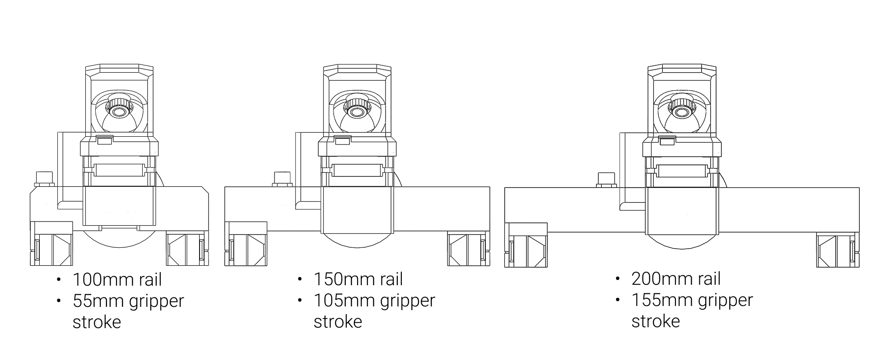
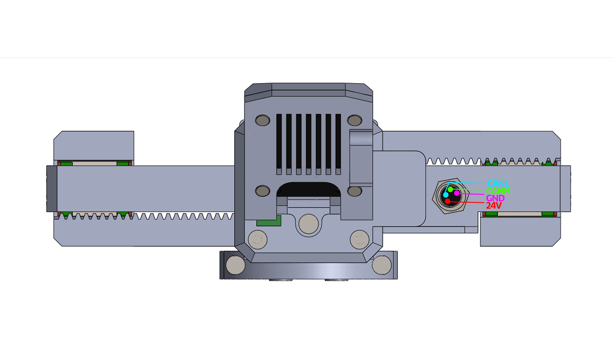
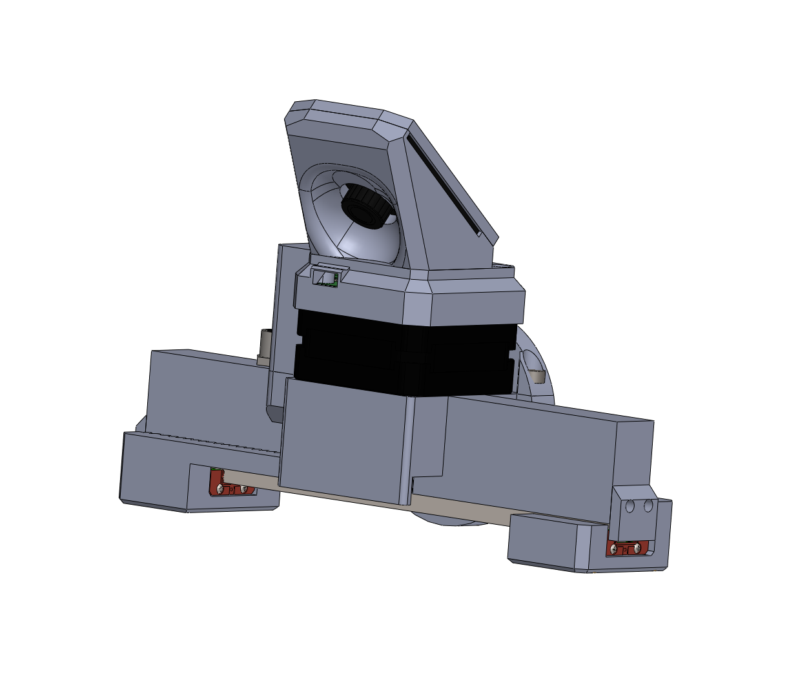

# Gripper Options & Specs


<p align="left"><br /></p>


## General specs

* Power supply: 24V
* Idle power: 0.5W
* Operating temperature: -5 to 65 °C
* Communication interface: CAN bus
* CAN baud rate: 1 Mbit/s
* Material: PETG plastic
* Stroke: 3 options: 55 mm, 105 mm, and 155 mm


## Gripper stroke

<p align="left"><br /></p>

The image shows an MSG gripper with a 105 mm stroke using a 150 mm rail. Other options are:

- With a 100 mm rail, stroke is 55 mm
- With a 200 mm rail, stroke is 155 mm

## Gripper force options

Another modular option is support for different stepper sizes. A larger stepper provides more torque but increases gripper weight.
Options are:

* 21.5mm stepper
* 40mm stepper
* 60mm stepper

## Grasps

The gripper can perform 2 types of grasps:

* External grasp – Used to hold objects by applying pressure from the outside.
* Internal grasp - Allows you to grasp hollow objects by applying pressure from the inside

## Pinout and connection
<p align="left"><br /></p>

The gripper is powered and controlled with a single cable that carries CAN bus communication and a 24V power supply.

!!! tip "Voltages"
    To power the gripper, use 24V.
    You can send commands to the gripper using a **5V** CAN bus.


## 3D model

[Link to the STEP model](https://github.com/PCrnjak/SSG-48-adaptive-electric-gripper/tree/main/STEPS)
<p align="left"><br /></p>


## Torque curves

Coming soon!

As shown in the plot, the relationship between current and applied force is linear. The unit of current is ampere [A], and the unit of force is newton [N].

!!! note "Torque curve"
    This plot only applies to grippers bought from Source Robotics that use BLDC motors with a fine-tuned Kt of 0.325. If you build your own gripper, this value might be different.

## CAN bus termination

<p align="left"><br /></p>

You can adjust this by flipping the switch to "ON" to enable 120 ohm CAN bus termination and to "1" to disable it.

## STEPFOC driver config


!!! note "Config"
    If you bought the gripper, it comes preconfigured and calibrated.

If you are building the gripper, send the following commands over serial to place the BLDC controller in gripper mode and enable the thermistor:

```text
#Gripper 1
#Term 1
#Kiiq 0.3
#Kpiq 3
#Save
#Clear
#Gripcal
```

## Gripper linear speed calculation

Gripper minimum and maximum speed are commanded and returned in 0-255 format.
In STEPFOC firmware, these values are mapped to ticks/s: 255 = 60000 ticks/s while 0 = 500 ticks/s.
Use this formula to calculate linear speed of the gripper jaws:

r = 0.0083 m, C is the commanded speed from 0–255

$$
\text{ticks_per_s} = 500 + \left(\frac{60000 - 500}{255}\right) \times C
$$

$$
\omega = \frac{\text{ticks_per_s}}{2^{14}} \times 2\pi
$$

$$
v = \omega \times r
$$

## Gripper force calculation

You can find your Kt value for your specific motor using the UART command `#Kt`.

!!! note "Iq units"
    Units of Iq are in mA. Convert to A before calculations.

$$
T = K_t \times I_q
$$

$$
F = \frac{T}{r}
$$