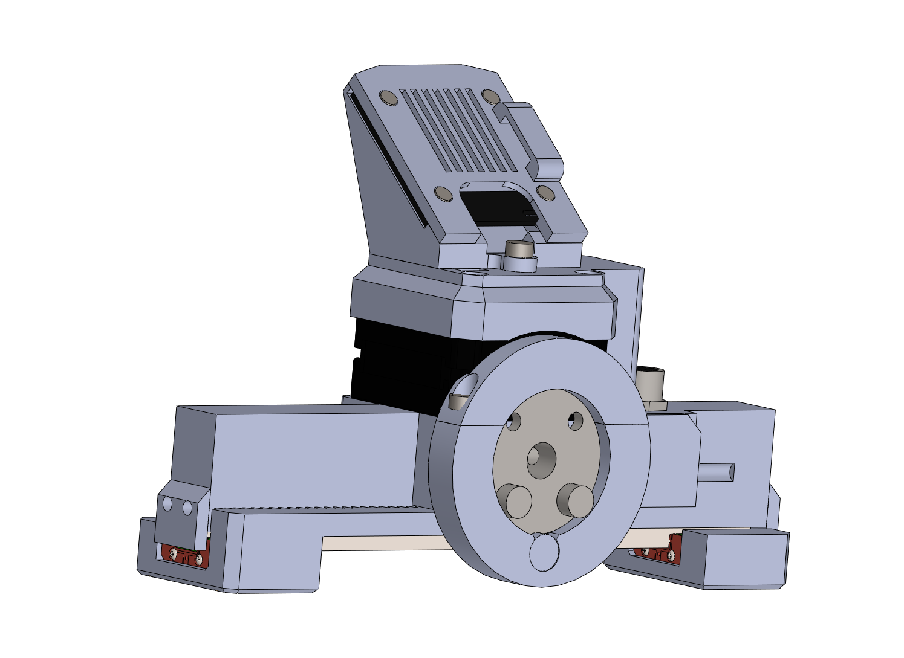
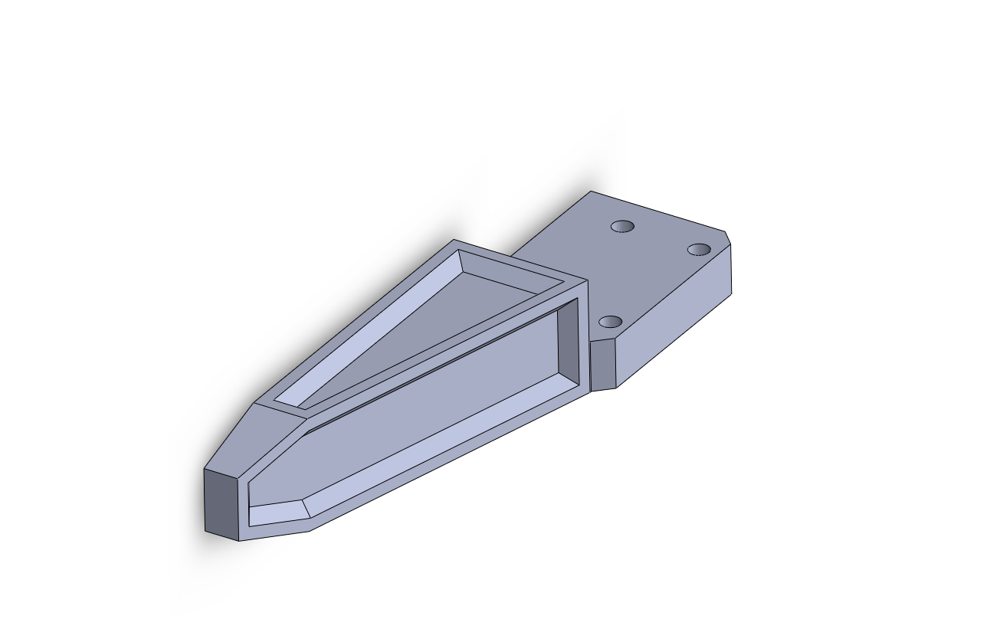

# Installation

## Coupler connector plate

The MSG gripper connects to 8 mm shafts by default. You can adapt the gripper for your robot by adjusting the `ring_cover` part or the full body of the gripper. STEP files are open source.

 

## PAROL6 installation

To use the MSG gripper with a PAROL6 robotic arm, use `ring_cover-PAROL6` from the GitHub STEP files folder.

 

## Electrical setup

!!! danger "If you are making DIY cables, make sure the pinout is correct"
	If the pinout is incorrect, you can damage the gripper.

You can buy suitable cables for PAROL6 [here!](https://source-robotics.com/products/gripper-cable)

Note that PAROL6 uses different cables compared to our closed-loop robots like PAR6 and FAZE4 v2.

Connect one end of the cable to the gripper and the other end to the robotic arm.

## Jaws

You can download [jaw STEP files](https://github.com/PCrnjak/MSG-compliant-AI-stepper-gripper/tree/main/STEP%20files/Gripper%20jaws%20attachment) and adapt your gripper jaws to your specifications.

The folder contains multiple jaw options.

 

