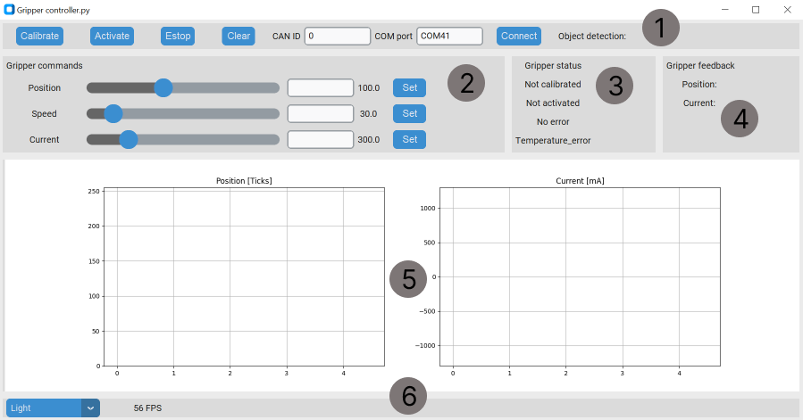

# Control

The primary control interface for the MSG gripper is **CAN bus**. The secondary control mode is **UART**.

!!! tip
    **The gripper can:**

    * Control the force, speed and position of gripper jaws
    * Movements of the both jaws are always in sync
    * Movement is initiated with a CAN "Send_gripper_data_pack" command
    * Gripper has a built-in object detection feature that reports when an object is detected

!!! danger "Go to the Application interfaces page for command details"

!!! warning "The best way to learn how the gripper works is through [examples](https://github.com/PCrnjak/Spectral-BLDC-Python/tree/main/examples)"

## Working principle

* After every power up the gripper needs to be calibrated to function.
* Calling the calibration command will start the gripper movement. Calibration will find exact endpoints of the gripper.
* After calibration the gripper needs to be activated.
* After activation, gripper can be used (If there are any errors they need to be cleared also)
* Now you can issue `Send_gripper_data_pack` commands to move the gripper to the specified position with desired speed and torque presets.

The gripper will never send CAN commands on its own. The gripper only responds to `Send_gripper_data_pack` with `Respond_Gripper_data_pack`.

!!! note "Empty commands"
    `Send_gripper_data_pack` can be an empty command containing no data. The gripper still responds with `Respond_Gripper_data_pack`. This option works well if you have many devices on the CAN bus and do not want to overload it with large data packets. A common workflow is to send one `Send_gripper_data_pack` with the required move, then poll status by sending `Send_gripper_data_pack` with no data.

!!! tip "Command rate"
    It is recommended to send commands to the gripper at 50 Hz or higher.

## Gripper GUI


You can install the GUI from [here](https://github.com/PCrnjak/SSG-gripper-GUI).
To connect to the gripper GUI, you need a [CAN bus adapter for PC](https://source-robotics.com/products/canvas-usb-to-can-adapter).


<p align="left"><br /></p>

* **Section 1** has a few commands important to operation of the gripper and connecting to it. 
* **Section 2** has sliders and entry boxes for commanding the gripper
* **Section 3** shows gripper status
* **Section 4** shows current gripper position and current
* **Section 5** shows live plots of gripper position and current
* **Section 6** shows FPS of the GUI and options for dark/light mode

!!! note "GUI connection"
    Only one gripper can be connected to the GUI at a time.

### Using the GUI

First, identify the COM port where your USB-to-CAN adapter is connected. Then enter it in the COM port box in section 1.
**Press connect.**
!!! note "Default CAN node ID"
    **Default CAN node ID is 0. To change it, check the Spectral Micro docs for CAN ID configuration: [Link](https://source-robotics.github.io/Spectral-BLDC-docs/apage1_specs/)**

After connecting to the GUI, **calibrate the gripper**. Press the calibrate button in section 1. The gripper starts to move, and if calibration succeeds, you will see "**Calibrated**" in section 3.

After calibration, press the **activate** button. If an error is active, press the **clear error** button.

Now you can control your gripper by setting position, speed and current values in section 2. 

!!! tip "Movement"
    Changing the position value starts gripper movement.

In section 5, you can see live values of gripper position and current.

## Using python API

This example calibrates the gripper, then opens and closes it. If the gripper is in an error state, clear the error first.
Get the API [here](https://github.com/PCrnjak/Spectral-BLDC-Python/tree/main).

```python
import Spectral_BLDC as Spectral
import time

Communication1 = Spectral.CanCommunication(bustype='slcan', channel='COM41', bitrate=1000000)
Motor1 = Spectral.SpectralCAN(node_id=0, communication=Communication1)

var = 0

while True:


    #Motor1.Send_gripper_data_pack(0,255,1500,1,1,0,0) 
    #Motor1.Send_gripper_data_pack(255,255,1500,1,1,0,0) 

    if var == 0:
        #Motor1.Send_Clear_Error()
        Motor1.Send_gripper_calibrate()
        var = 1
    elif var == 1:
        Motor1.Send_gripper_data_pack(100,20,500,1,1,0,0) 
        var = 2
    elif var == 2:
        Motor1.Send_gripper_data_pack(10,20,500,1,1,0,0) 
        var = 0


    message, UnpackedMessageID = Communication1.receive_can_messages(timeout=0.2) 

    if message is not None:
        print(f"Message is: {message}")
        print(f"Node ID is : {UnpackedMessageID.node_id}")
        print(f"Message ID is: {UnpackedMessageID.command_id}")
        print(f"Error bit is: {UnpackedMessageID.error_bit}")
        print(f"Message length is: {message.dlc}")
        print(f"Is is remote frame: {message.is_remote_frame}")
        print(f"Timestamp is: {message.timestamp}")

        Motor1.UnpackData(message,UnpackedMessageID)
    else:
        print("No message after timeout period!")
    print("")
    time.sleep(4)

```

## Using UART

To use UART, access the UART port on the MSG gripper. Unscrew the coupler connector and connect a UART adapter to the connector shown in the image. The interface uses 3.3V; using 5V can damage your driver or gripper.
To read more about UART with MSG/STEPFOC, go to this [link](https://source-robotics.github.io/STEPFOC-docs/uart/).

A compatible USB-to-UART adapter is available here: [Link](https://source-robotics.com/products/usb-to-serial-adapter).

Setup:

* Gripper 1 (tells the motor controller to operate in gripper mode)
* Gripcal (calibrates the gripper)

Control:

* Gripvel x (x is a value from 0 - 255; 0 is minimum speed, 255 is maximum speed)
* Gripcur x (x is a value from 0 - 700 [mA], depending on your stepper)
* Grippos x (x is a value from 0 - 255; 0 is fully open, 255 is fully closed)

!!! note "Movement trigger"
    **Only Grippos starts gripper movement.**


