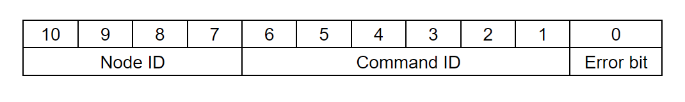

# Application Interfaces

Since the MSG gripper is based on STEPFOC drivers, which are based on [Spectral Micro BLDC drivers](https://github.com/PCrnjak/Spectral-Micro-BLDC-controller), it inherits their control methods and functionality.
This page describes only the commands needed for gripper operation. For the full command list, go [here](https://source-robotics.github.io/STEPFOC-docs/can/).
The gripper is also based on Spectral Micro, so it includes a UART interface for control.

 

Bits **10 - 7** of CAN ID represent the node ID.
Node IDs range from 0 to 15, which means you can have a maximum of 16 different devices on one CAN bus.

!!! note "Default node ID"
    The default node ID of the gripper is 0. To change it, check the Spectral Micro docs.

Bits **6 - 1** of the CAN ID represent the command ID.
Command IDs range from 0 to 63.

Bit **0** represents the error bit. If STEPFOC has any active error, this bit is set to 1. This bit is always sent by the driver and is independent of command ID and data.

Node with smallest Node ID is strongest in CAN bus arbitration.

## CAN commands

### Respond_Gripper_data_pack

* Command ID: 60  
* Direction: Gripper -> host  
* Python call: None, this command is sent only by driver  
* Length: 4 bytes  
* Type of frame: standard  

Size (bytes) | Variable (STEPFCO Lib python attribute)  | Type | Details
---- | ---- | ---- | ----
0  | gripper_position | unsigned 8bit |
1-2 | gripper_current |  16 bit signed |
3(bit 0) | gripper_activated | bit (0/1) | gripper activated (1) / deactivated (0)
3(bit 1) | gripper_action_status | bit (0/1) |  1 is goto, 0 is idle or performing auto release or in calibration
3(bit 2 and 3) | gripper_object_detection | 2 bit | 0 in motion, 1 object detected while closing, 2 object detected while opening, 3 at position
3(bit 4) | gripper_temperature_error | bit (0/1) | gripper_temperature_error
3(bit 5) | gripper_timeout_error | bit (0/1) | gripper_timeout_error
3(bit 6) | gripper_estop_error | bit (0/1) | gripper_estop_error
3(bit 7) | gripper_calibrated | bit (0/1) | gripper calibration status; calibrated (1) / not calibrated (0)

---

---

### Send_gripper_data_pack

* Command ID: 61  
* Direction: Host -> Gripper  
* Python API reference: Send_gripper_data_pack()  
* Type of frame: standard  
* Length: 5 bytes

Size (bytes) | Variable | Type | Details
---- | ---- | ---- | ----
0  | Position | unsigned 8bit |
1 | Velocity | unsigned 8bit |
2-3 | Current | signed 16bit |
4(bit 0)  | Gripper activate |  bit (0/1) | 0 - deactivate the gripper, 1 - activate the gripper
4(bit 1)  | Gripper action status |  bit (0/1) | 0 - idle , 1 - movement
4(bit 2)  | Gripper estop status |  bit (0/1) | 0 - No estop, 1 - Estop pressed
4(bit 3)  | Gripper release direction |  bit (0/1) | Not used

Driver will respond to this command with: 
**Respond_Gripper_data_pack**

Alternatively, you can send an empty `Send_gripper_data_pack` command.

* Command ID: 61  
* Direction: Host -> Gripper  
* Python API reference: Send_gripper_data_pack()  
* Type of frame: standard  
* Length: 0 bytes

Driver will respond to this command with: 
**Respond_Gripper_data_pack**

---

### Send_gripper_calibrate

* Command ID: 62  
* Direction: Host -> Gripper  
* Python API reference: Send_gripper_calibrate()  
* Type of frame: standard  
* Length: 0 bytes

**Driver will not respond to this command!** 

---

---

### Send_CAN_ID

This command will set a new CAN ID for your motor driver.  
The ID you send becomes the new motor ID.

* Command ID: 11  
* Direction: Host -> Gripper  
* Python API reference: Send_CAN_ID()  
* Type of frame: standard  
* Length: 1 byte

Size (bytes) | Variable | Type 
---- | ---- | ----
0 | ID | byte

**Driver will not respond to this command!** 

---

### Send_Save_config

* Command ID: 13  
* Direction: Host -> Gripper  
* Python API reference: Send_Save_config()  
* Type of frame: standard  
* Length: 0 bytes

**Driver will not respond to this command!** 

---

### Send_Reset

* Command ID: 14  
* Direction: Host -> Gripper  
* Python API reference: Send_Reset()  
* Type of frame: standard  
* Length: 0 bytes

**Driver will not respond to this command!** 

---

### Send_Clear_Error

* Command ID: 1  
* Direction: Host -> Gripper  
* Python API reference: Send_Clear_Error()  
* Type of frame: standard  
* Length: 0 bytes

**Driver will not respond to this command!** 

---

## UART interface

For the full list of UART commands, check this [link](https://source-robotics.github.io/STEPFOC-docs/uart/).

### Gripper commands
Commands used in gripper mode. Procedure:

* Gripper 1 (tells the motor controller to operate as a gripper)
* Gripcal (calibrates the gripper)
* Gripvel x (x is a value from 0 - 255; 0 is minimum speed, 255 is maximum speed)
* Gripcur x (x is value from 0 - 1000 [mA])
* Grippos x (x is a value from 0 - 255; 0 is fully open, 255 is fully closed)

Name | Type | Input Data type | Description | Response
---- | ---- | ---- | ---- | ----
`Gripper` | Set/Get | bool | `Set/get Am I a gripper` | Is this device gripper or not
`Gripcal` | Action |  | `Start gripper calibration` |   None
`Grippos` | Set/Get | uint8_t | `Set/get desired gripper setpoint position (from 0 to 255). Also sets gripper into GOTO mode and executes the command` | Gripper position value
`Gripvel` | Set/Get | uint8_t | `Set/get desired gripper velocity setpoint (from 0 to 255)` | Gripper velocity value setpoint
`Gripcur` | Set/Get | int | `Set/get desired gripper current in mA from 0 - 1000 (values below 150 can be unstable)` | Gripper current value setpoint; to get actual current value use #Iq
`Gripact` | Set/Get | bool | `Set/get gripper activation bit` | Is gripper activated or not
`Gripstop` | Set/Get | bool | `Set/get gripper Estop bit` | Gripper estop bit status
`Gripinfo` | Action |  | `Print information about this gripper` | All information about gripper like: is it calibrated, status, endstop values...